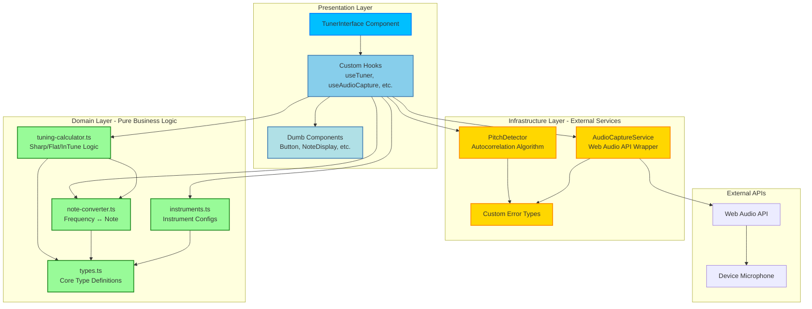
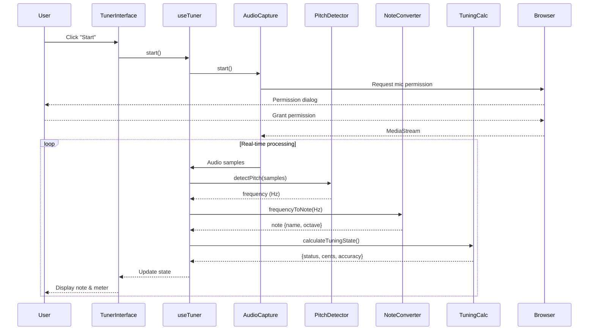
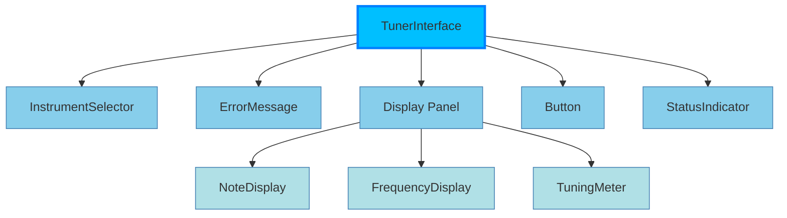

# Tuner App - Architecture Documentation

## Clean Architecture Diagram



## Dependency Flow

The architecture strictly enforces the dependency rule:

```
Presentation → Domain ← Infrastructure
     ↓                      ↓
     → Infrastructure →  External APIs
```

### Key Rules

1. **Domain has zero dependencies** - Pure TypeScript, no React, no external libraries
2. **Infrastructure depends on external APIs** - Web Audio API, browser APIs
3. **Presentation depends on both** - Uses hooks to orchestrate domain + infrastructure
4. **Components are pure** - Only receive props, no business logic

## Data Flow Example

User clicks "Start Tuning":



## Component Composition

The UI is built through composition of small, focused components:



## File Organization

```
src/
├── domain/                    # 🟢 Pure Logic (Green)
│   ├── types.ts              # Type definitions
│   ├── note-converter.ts     # Mathematical conversions
│   ├── tuning-calculator.ts  # Tuning logic
│   └── instruments.ts        # Configuration data
│
├── infrastructure/            # 🟡 External Services (Gold)
│   ├── audio-capture.ts      # Microphone access
│   ├── pitch-detector.ts     # Signal processing
│   └── audio-errors.ts       # Error handling
│
├── presentation/              # 🔵 UI Layer (Blue)
│   ├── hooks/                # Smart - contain logic
│   │   ├── useAudioCapture.ts
│   │   ├── usePitchDetection.ts
│   │   ├── useInstrument.ts
│   │   └── useTuner.ts
│   │
│   └── components/           # Dumb - only presentation
│       ├── Button.tsx
│       ├── FrequencyDisplay.tsx
│       ├── NoteDisplay.tsx
│       ├── TuningMeter.tsx
│       ├── InstrumentSelector.tsx
│       ├── StatusIndicator.tsx
│       ├── ErrorMessage.tsx
│       └── TunerInterface.tsx
│
├── styles/                   # Design system
│   └── components.css
│
├── index.css                 # Frutiger Aero design tokens
├── App.tsx                   # Root component
└── main.tsx                  # Entry point
```

## Benefits of This Architecture

### Testability
- Domain logic can be unit tested without React
- Infrastructure can be mocked for testing
- Components can be tested in isolation

### Maintainability
- Clear separation makes changes easier
- Each layer has a single responsibility
- Dependencies flow in one direction

### Scalability
- Easy to add new instruments (just update domain)
- Can swap pitch detection algorithms (infrastructure)
- Can redesign UI without touching logic (presentation)

### Reusability
- Domain logic could be used in a mobile app
- Components can be used in other projects
- Hooks encapsulate reusable behavior
